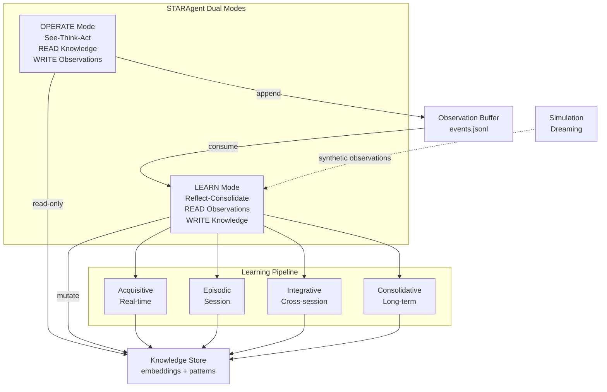
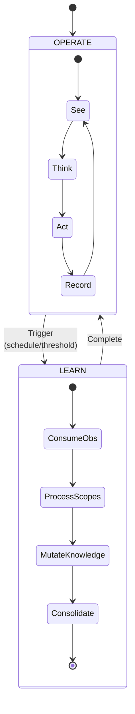
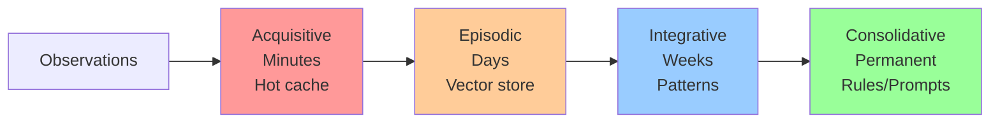
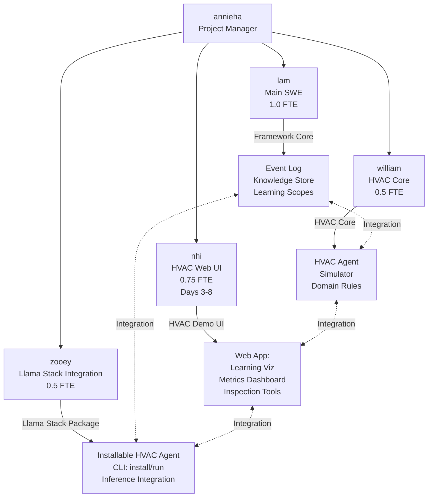
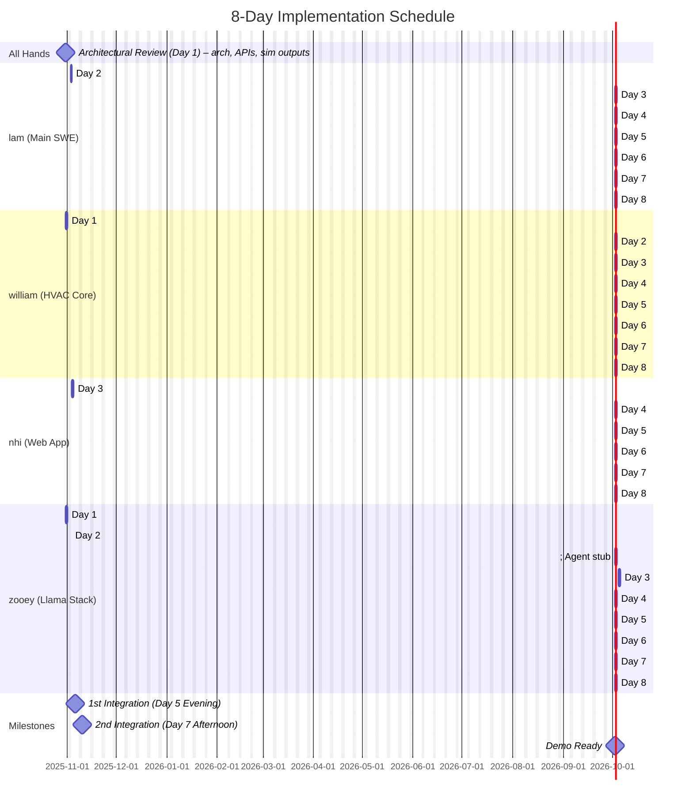

# Dana Reflection Framework: Design Document

## Executive Summary

The Reflection Framework enables Dana STARAgents to learn from experience through a dual-mode architecture: **OPERATE** mode for real-time execution and **LEARN** mode for asynchronous knowledge mutation. This document outlines the architecture for the HVAC autonomous agent use case with an 8-day implementation plan.

## Motivations & Impact

**Why HVAC**

HVAC represents one of the largest automation domains — hardware spending now exceeds semiconductors and data centers. It sits at the intersection of control systems, sensor feedback, and human comfort, making it a real-world proving ground for autonomous agents in physical environments.

Efficiency matters strategically: training a single GPT-scale model consumes ~700,000L fresh water, with global AI water withdrawal projected at 6B m³ by 2027. HVAC provides a credible, measurable domain to demonstrate adaptive autonomy — not just LLM-powered chat, but operational control with real stakes.

**Value Propositions**

**For Dana/Aitomatic:**
- Reference implementation: Dana agent installable + runnable via Llama Stack
- Blueprints others can extend for industrial/enterprise use cases
- Product milestone: validates Dana adaptive autonomous agents are ready for real-world physical systems

**For Honeywell:**
- Concrete step toward autonomous building management in $50B+ commercial energy market
- Demonstrates adaptive behavior with targeted improvements: 15-25% energy reduction, 40% fewer comfort complaints, 60% faster anomaly diagnosis
- Sets stage for pilot evaluation in real-building scenarios

**For Llama Stack:**
- Demonstrates real industrial use case beyond text/chat
- Shows Llama Stack running an operational agent loop (See-Think-Act-Reflect) in physical-system context
- Establishes Llama Stack as viable foundation for edge-aligned, safety-sensitive automation

**Broader Pattern:**
Broader Pattern: This is not only an HVAC demo. It proves an architecture where open, sovereign LLM foundations (Llama Stack) + a deterministic agent system with built-in reflection (Dana) deliver adaptive autonomy for high-stakes physical systems. Success here validates a repeatable model for mission-critical AI systems.

## Architecture Overview



## Core Concepts

### Agent Operating Modes



**OPERATE Mode:**
- Synchronous, latency-sensitive
- Read-only knowledge access
- Append observations to buffer
- Never blocks on learning

**LEARN Mode:**
- Asynchronous, can be slow
- Processes observation backlog
- Mutates knowledge store
- Runs simulation campaigns (dreaming)

### Event Sourcing Pattern

All observations and feedback stored as typed events in append-only log:

```json
{"type": "hvac_observation", "timestamp": "2024-10-31T10:00:00", "zone": "floor_2_west", "temp": 72.5, "setpoint": 72, "occupancy": 12}
{"type": "action_taken", "timestamp": "2024-10-31T10:00:05", "zone": "floor_2_west", "action": "increase_cooling", "magnitude": 0.5}
{"type": "feedback", "timestamp": "2024-10-31T10:15:00", "ref_event_id": "action_123", "outcome": "comfort_complaint", "source": "occupant"}
```

### Sessions and Learning Scopes (KISS Mapping)

- Session = episodic unit (1:1). All events in a session carry `session_id`.
- Per-STAR loop: micro-acquisitions (system prompt timeline updates) in hot cache.
- Per-query (may span multiple STAR loops): acquisitive artifact in working memory.
- Integrative: runs across sessions (e.g., daily) to extract cross-session patterns.
- Consolidative: promotes stable knowledge (e.g., weekly), session-agnostic but with provenance.

Prompt Learning:
- Prompt versions are persisted under `knowledge/prompts` with provenance and metrics.
- Prompt learning for resources and workflows is explicitly deferred to the next sprint.

Triggers:
- On STAR loop end → update acquisitive hot cache.
- On query completion → write/roll up acquisitive artifact.
- On session end → write episodic summary (embedding + metadata + provenance).
- Daily → run integrative consolidation across recent sessions.
- Weekly → run consolidative promotion of validated rules/prompts.

## Directory Structure

```
dana_data/
├── events/
│   ├── production/
│   │   └── events.jsonl                    # Append-only event log
│   └── simulation/
│       └── dream_campaign_001.jsonl        # Simulated experiences
│
├── knowledge/
│   ├── acquisitive/
│   │   └── working_memory.json             # Hot cache (TTL: 1 hour), keyed by query_id/session_id
│   │
│   ├── episodic/
│   │   ├── embeddings.npy                  # Session-level summary embeddings (1:1 with session_id)
│   │   ├── metadata.jsonl                  # Per-session metadata (provenance, counts, timebounds)
│   │   └── stats.json                      # Count, last_consolidation
│   │
│   ├── integrative/
│   │   ├── patterns.json                   # Extracted patterns
│   │   ├── clusters.npy                    # Cluster centroids
│   │   ├── cluster_metadata.json           # Cluster semantics
│   │   └── consolidation_log.jsonl         # Audit trail
│   │
│   ├── prompts/                            # Prompt learning (this sprint)
│   │   ├── versions/
│   │   │   ├── v0001.txt
│   │   │   └── v0002.txt
│   │   ├── changelog.jsonl                 # Prompt diffs, provenance, metrics
│   │   ├── active.json                     # Pointer to active version
│   │   └── NOTE.txt                        # Resource/Workflow prompt learning deferred to next sprint
│   │
│   └── consolidative/
│       ├── rules/
│       │   └── validated_rules.json        # High-confidence rules
│       ├── prompts/
│       │   └── system_prompt_v2.txt        # Global prompt refinements (deprecated by prompts store)
│       └── baselines/
│           └── performance_metrics.json    # Expected performance
│
└── meta/
    └── agent_state.json                    # Mode, last_learn_time, etc.
```

## Learning Scopes



| Scope | Timeframe | Storage | Purpose | Demo Status |
|-------|-----------|---------|---------|-------------|
| **Acquisitive** | Minutes-Hours | In-memory JSON | Immediate adaptation | Stubbed |
| **Episodic** | Days-Weeks | NumPy vectors | Similarity-based retrieval | **Full Implementation** |
| **Integrative** | Weeks-Months | Clusters + Patterns | Synthesized rules | **Prototype** |
| **Consolidative** | Permanent | Validated rules | Production knowledge | Stubbed |

## HVAC Use Case Specifics

### Learning Opportunities

**1. Zone-Specific Thermal Characteristics**
- Learning: Each zone's thermal mass, airflow patterns, sun exposure
- Source: Temperature sensor data, HVAC response times
- Destination: Episodic → Integrative patterns

**2. Occupancy Pattern Prediction**
- Learning: When zones are occupied, density patterns
- Source: Occupancy sensors, calendar data, historical patterns
- Destination: Integrative patterns → Predictive models

**3. Comfort vs Efficiency Tradeoffs**
- Learning: Acceptable temperature ranges per zone/time
- Source: Comfort complaints, energy consumption, occupant feedback
- Destination: Consolidative rules

**4. Anomaly Detection Improvement**
- Learning: What's normal for THIS building
- Source: Equipment sensor data, maintenance logs
- Destination: Episodic → Integrative baselines

### Demo Scenario

**Before Learning:**
```
Zone overheating → Generic response → Energy waste + discomfort
Anomaly detected → 10 possible causes → Slow diagnosis
```

**After Learning (Session 1-10):**
```
Zone overheating → Retrieve similar episodes → Optimized response
Anomaly detected → "Similar to episode #47" → Fast root cause
```

Agent demonstrates measurable improvement in energy efficiency, comfort, and diagnostic speed (see Success Metrics).

## Core Interfaces

```python
# Agent mode enumeration
class AgentMode(Enum):
    OPERATE = "operate"
    LEARN = "learn"

# Event types
@dataclass
class Event:
    type: str
    timestamp: datetime
    agent_id: str
    data: dict
    metadata: dict

# Knowledge with provenance
@dataclass  
class Knowledge:
    content: Any
    scope: Scope
    confidence: float
    provenance: dict
    created: datetime
    ttl: Optional[timedelta]

# Agent with dual modes
class STARAgent:
    def operate(self, environment) -> Action
    def learn(self, duration: Optional[timedelta] = None)
    def dream(self, simulator: SimulationEnvironment, n_episodes: int)

# Storage interfaces
class EventLog:
    def append(self, event: Event)
    def read_since(self, checkpoint: int) -> Iterator[Event]

class KnowledgeStore:
    def retrieve(self, query, scope: Scope, k: int) -> List[Knowledge]
    def write(self, knowledge: Knowledge, scope: Scope)

# Prompt persistence and APIs
@dataclass
class PromptVersion:
    version: str
    content: str
    created: datetime
    provenance: dict
    metrics: dict

class LocalPromptStore:  # directory-based persistence under knowledge/prompts
    def get_active(self) -> PromptVersion
    def list_versions(self) -> List[PromptVersion]
    def set_active(self, version: str)
    def create_version(self, content: str, provenance: dict) -> PromptVersion

class PromptsAPI:
    def render(self, template_name: str, context: dict) -> str
    def learn(self, signal: dict) -> PromptVersion  # creates new version when warranted
```

## Team Structure & Coordination



**Coordination Strategy:**
- Daily 15-min standups (9:00 AM)
- Sync integration sessions (Wed, Fri afternoons)
- Async: Slack for quick questions, PRs for code review
- AI coding: Each dev uses AI pair programming to 2x velocity

## 8-Day Implementation Plan

### Day 1 - Friday, Oct 31, 2025 - Foundation & Setup (Lam unavailable until Day 2)

**@annieha (PM):**
- Kickoff (30 min): review design, assign roles, define success metrics
- Set up tracking (Jira/Linear) and demo milestones

**All-hands (Architectural Review - 60 min):**
- Review architecture and interfaces (`EventLog`, `KnowledgeStore`, `STARAgent`)
- Confirm Llama Stack integration points: `Inference API`, `Agent API` (primary focus); `Storage API`, `Conversation API`, `RAG` deferred to focus on packaging/installation (Prompts is local filesystem-based)
- Align on simulator requirements: expose environment state outputs/telemetry, not just accept inputs; simulated HVAC data (no real building data yet)
- Align on web application requirements: lightweight demo app to drive HVAC use case and demonstrate learning
- Note: Lam unavailable Day 1; foundational work shifts to Day 2

**@lam (Main SWE):** Not available - work shifts to Day 2

**@william (Application) - 4 hours:**
- [ ] HVAC simulator design (zones, thermal dynamics, environment state outputs/telemetry)
- [ ] Simulator skeleton generated with AI assistant
- [ ] Define web app integration points with agent framework, simulator, and LLM APIs
- **Deliverable:** Simulator stub with basic zone dynamics and observable environment state; Web app integration points defined

**@zooey (Integration) - 4 hours:**
 - [ ] Llama Stack dev environment ready
 - [ ] LLM client wrapper created and tested
 - [ ] Define and sequence API contracts: `Inference`, `Agent` (primary focus for packaging); `Storage`, `Conversation`, `RAG` deferred (Finetuning deferred)
 - **Deliverable:** Baseline connectivity + API contract plan (focusing on Inference/Agent APIs for packaging deliverable)

**Sync:** 4:30 PM - Blockers and priorities

Deliverables by role:
- @annieha: Success metrics, tracking/milestones defined
- All-hands: Architecture reviewed, integration points agreed (Lam's foundational work deferred to Day 2)
- @william: Simulator stub with observable environment state; Web app integration points defined
- @zooey: Llama Stack connectivity + API contract plan

---

### Day 2 - Monday, Nov 3, 2025 - Foundation & Core Learning Loop

**@lam (Main SWE) - 8 hours:**
- [ ] Project structure and tooling
- [ ] Implement `EventLog` (append-only JSONL)
- [ ] Implement `KnowledgeStore` interfaces + filesystem backend
- [ ] Initialize directory-based prompts store; scaffold `LocalPromptStore` and `PromptsAPI`
- **Deliverable:** Event log + knowledge store scaffolding (Day 1 work shifted)

**@william - 4 hours:**
- [ ] Complete simulator (temperature dynamics, setpoint control, environment outputs)
- [ ] Create test scenarios (overheating, occupancy changes)
- [ ] Web application structure/skeleton (lightweight framework: Streamlit/Flask/FastAPI) - using Day 1 integration points
- [ ] Web app: Basic UI layout and simulator integration scaffolding
- **Deliverable:** Runnable simulator with realistic behavior and exported state/telemetry; Web app structure + basic UI with simulator connection

**@zooey - 4 hours:**
 - [ ] Implement `Inference API` integration (model selection, health check)
 - [ ] Stub `Agent API` (decision call surface)
 - **Deliverable:** `Inference API` live; `Agent` stub

**Sync:** 4:30 PM - Review foundational progress

Deliverables by role:
- @lam: Event log + knowledge store scaffolding; prompts directory scaffolded (Day 1 shifted work)
- @william: Runnable simulator with exported state/telemetry; Web app structure + basic UI with simulator connection
- @zooey: Inference API live; Agent stub

---

### Day 3 - Tuesday, Nov 4, 2025 - Core Learning Loop (cont'd)

**@lam - 8 hours:**
- [ ] Implement Episodic scope (events → embeddings)
- [ ] Retrieval via cosine similarity
- [ ] `STARAgent` skeleton (operate/learn modes)
- [ ] Implement end-of-session write trigger (episodic summary on session close)
- [ ] Local prompts service (filesystem): render + learn (MVP prompt learning)
- [ ] Create testable interfaces/harness for episodic learning (william can use to test HVAC integration)
- **Deliverable:** Working episodic learning pipeline with testable interfaces/harness (Day 2 work shifted)

**@william - 4 hours:**
- [ ] Add simulator observability (logging, metrics)
- [ ] Prepare episodic learning scenarios/test cases
- [ ] Ensure simulator/agent integration ready for episodic learning (verify agent can receive and process HVAC events)
- **Deliverable:** Enhanced simulator with observability; Integration ready for episodic learning

**@nhi - 6 hours:** (Web UI - Starting today)
- [ ] Handoff with william (understand HVAC simulator)
- [ ] **Complete demo design:** narrative/story arc, UI wireframe (3-panel layout: Simulator | Agent Modes | Learning), interaction flow, key "wow moments"
- [ ] Choose web framework (Streamlit recommended)
- **Deliverable:** Complete design doc + wireframe + framework chosen

**@zooey - 4 hours:**
 - [ ] Design Llama Stack package structure for Dana HVAC agent
 - [ ] Define CLI commands: `llama stack install/run dana-hvac-agent`
 - [ ] Scaffold package directory structure (dependencies, entry points)
 - **Deliverable:** Package structure designed; CLI commands defined

**Sync:** 4:30 PM - Review episodic pipeline progress; prepare for Day 4 episodic learning and packaging

Deliverables by role:
 - @lam: Episodic pipeline functional with end-of-session write trigger; Testable interfaces/harness ready for william
 - @william: Simulator with observability added; Integration ready for episodic learning
 - @nhi: Complete design doc + wireframe + framework chosen
- @zooey: Agent wired to Inference API; decisions flowing (foundation for packaging)

---

### Day 4 - Wednesday, Nov 5, 2025 - Episodic Learning & Llama Stack Packaging

**@lam - 8 hours:**
- [ ] Framework-level validation: test episodic learning pipeline with synthetic scenarios (prove learning works at framework level)
- [ ] Create test utilities/demo notebook showing learning curve (for william to use as reference)
- [ ] Implement per-query acquisitive artifact write on query completion
- [ ] Make agent loop observable/loggable in framework (hooks for OPERATE: See → Think → Act; LEARN: Reflect)
- [ ] Ensure EventLog/KnowledgeStore paths are configurable (for CLI packaging)
- **Deliverable:** Framework-level learning validation complete; Test utilities ready; Agent loop logging hooks added

**@william - 4 hours:**
- [ ] Wire episodic learning functionality into HVAC agent/simulator (use lam's episodic pipeline and test harness from Day 3)
- [ ] Configure agent to retrieve episodic memories for HVAC decisions (query episodic knowledge store during decision-making)
- [ ] Ensure HVAC agent emits agent loop steps (OPERATE: See-Think-Act; LEARN: Reflect)
- [ ] Make agent runnable as standalone (entry point for CLI packaging)
- [ ] Run basic HVAC test scenarios - verify agent can retrieve and use episodic memories
- **Deliverable:** Complete runnable HVAC agent with episodic learning and dual-mode logging; Ready for packaging

**@nhi - 6 hours:**
- [ ] Create app structure and 3-panel layout skeleton
- [ ] **Simulator View:** Zone visualization (temperature colors, current state)
- [ ] **Agent View:** Dual-mode display (OPERATE: See → Think → Act; LEARN: Reflect)
- [ ] Hook up william's simulator to live display
- [ ] Basic controls: Start Episode, Stop Episode, Scenario Selector
- **Deliverable:** Working simulator + agent visualization in web app

**@zooey - 4 hours:**
 - [ ] Implement `llama stack install dana-hvac-agent` (package installation + dependencies)
 - [ ] Create entry point for `llama stack run dana-hvac-agent` (launches agent + web UI)
 - [ ] Wire william's HVAC agent to CLI run command
 - [ ] Wire nhi's web UI to auto-launch with agent
 - [ ] **Evening: Integration checkpoint with nhi** - validate install → run launches everything
 - **Deliverable:** Installation working; Single run command launches agent + UI

**Sync:** 4:00 PM - Review episodic learning progress and packaging readiness

Deliverables by role:
- @lam: Framework-level learning validation complete; Test utilities ready; Agent loop logging hooks added
- @william: Complete runnable HVAC agent with episodic learning and dual-mode logging; Ready for packaging
- @nhi: Working simulator + agent visualization in web app
- @zooey: Installation working; Single run command launches agent + UI

---

### Day 5 - Thursday, Nov 6, 2025 - 1st Integration Milestone

**@lam - 8 hours:**
- [ ] Implement Integrative scope (clustering, pattern extraction)
- [ ] Consolidation trigger logic
- [ ] Production hardening (error handling)
- [ ] **Integration support:** Ensure nhi can demonstrate both episodic + integrative learning
- [ ] **Evening: 1st Integration Checkpoint** - validate full learning pipeline
- **Deliverable:** Integrative learning working; Full pipeline validated

**@william - 4 hours:**
- [ ] Run HVAC-specific learning proof: multiple episodes with same scenario repeated
- [ ] Create before/after demo scenarios: compare agent performance in first episode vs. later episodes
- [ ] Measure and document learning proof: collect metrics showing agent improvement (energy, response time, comfort)
- [ ] Prepare learning curve data (uses lam's Day 4 test utilities)
- **Deliverable:** HVAC learning proof demonstrated with metrics; Before/after scenarios ready; Learning curve data collected

**@nhi - 6 hours:**
- [ ] **Learning View:** Episodic memory timeline (events being recorded)
- [ ] Display retrieved memories during agent Think phase ("Recalling Episode #3...")
- [ ] Show Reflect phase: what agent learned from this episode
- [ ] Episode counter and session tracking
- [ ] Before/after comparison mode (Episode 1 vs Episode 10) using william's scenarios
- [ ] **Evening: 1st Integration Checkpoint** - validate demo runs end-to-end
- **Deliverable:** Learning visualization complete; Demo ready for integration

**@zooey - 4 hours:**
- [ ] Complete `llama stack run dana-hvac-agent` command: agent runs in OPERATE mode with automatic LEARN triggers
- [ ] Add console output formatting: show OPERATE mode (See-Think-Act) and LEARN mode transitions (Reflect + episodic summary writes)
- [ ] Ensure web UI launches automatically with agent
- [ ] Test full flow: install → run → see OPERATE/LEARN modes in console → see learning in UI
- [ ] **Evening: 1st Integration Checkpoint** - validate complete install → run flow
- **Deliverable:** Complete CLI commands working; End-to-end install → run validated

**Operational cadence notes:**
- Integrative runs daily across sessions (batch job).

**Evening Integration Checklist (All team):**
- [ ] `llama stack install dana-hvac-agent` succeeds
- [ ] `llama stack run dana-hvac-agent` launches agent + web UI
- [ ] Console shows **OPERATE mode:** See → Think → Act per episode
- [ ] Console shows **LEARN mode:** Reflect + episodic summary writes on session end
- [ ] Agent retrieves episodic memories during OPERATE (Think phase)
- [ ] Integrative learning extracts patterns (daily batch job working)
- [ ] Web UI shows learning visualization and improvement
- [ ] Before/after comparison demonstrates learning
- [ ] Knowledge files update automatically (`events.jsonl` during OPERATE, `knowledge/` during LEARN)

**Sync:** 6:00 PM - **1st Integration Milestone Validation**

Deliverables by role:
- @lam: Integrative scope working + consolidation trigger logic; Full pipeline validated
- @william: HVAC learning proof demonstrated with metrics; Before/after scenarios + learning curve data
- @nhi: Learning visualization complete; Demo ready for integration
- @zooey: Complete CLI commands working; End-to-end install → run validated

---

### Day 6 - Friday, Nov 7, 2025 - Inspection Tools & Metrics

**@lam - 8 hours:**
- [ ] Complete inspection tools: memory browser, pattern viewer, rule inspector
- [ ] Metrics collection finalized (energy, comfort, accuracy)
- [ ] Performance optimization (retrieval speed)
- **Deliverable:** All inspection tools ready; Metrics system complete

**@william - 4 hours:**
- [ ] Enhance simulator realism (improved thermal dynamics, more realistic scenarios)
- [ ] Validate metrics collection through full pipeline
- [ ] Test end-to-end with enhanced simulator
- **Deliverable:** Enhanced HVAC scenarios; Metrics validated

**@nhi - 6 hours:**
- [ ] **Learning Curve Chart:** Performance improvement over episodes using william's metrics
- [ ] **Auto-Run Mode:** Run 10 episodes automatically, show progression
- [ ] **Learning Proof Mode:** Same scenario repeated, metrics improve
- [ ] Integrate lam's inspection tools (memory browser, pattern viewer)
- [ ] Polish dual-mode visualization (OPERATE vs LEARN mode clarity)
- **Deliverable:** Demo with metrics + inspection capability

**@zooey - 4 hours:**
- [ ] Installation verification script (test install on clean environment)
- [ ] Package configuration files (defaults for HVAC demo scenarios)
- [ ] Dependency management (ensure all deps install correctly)
- [ ] Test cross-platform (Linux, macOS if applicable)
- **Deliverable:** Robust installation; Configuration ready

**Sync:** 4:30 PM - Review inspection tools and metrics integration

Deliverables by role:
- @lam: All inspection tools ready; Metrics system complete
- @william: Enhanced HVAC scenarios; Metrics validated
- @nhi: Demo with metrics + inspection capability
- @zooey: Robust installation; Configuration ready

---

### Day 7 - Monday, Nov 10, 2025 - Consolidative Learning & 2nd Integration

**@lam - 8 hours:**
- [ ] Add consolidative learning demonstration (show stable rules emerged)
- [ ] Add prompt learning demonstration (show prompt versions/evolution)
- [ ] Performance optimization for demo
- [ ] Final framework polish
- **Deliverable:** Complete learning scopes demonstrated (Acquisitive/Episodic/Integrative/Consolidative)

**@william - 4 hours:**
- [ ] Create failure/recovery scenarios (what happens when agent makes mistakes)
- [ ] Final HVAC validation and testing
- [ ] Validate HVAC domain semantics in demo
- **Deliverable:** All HVAC scenarios validated; Failure scenarios ready

**@nhi - 6 hours:**
- [ ] Integrate consolidative + prompt learning views (show stable rules, prompt evolution)
- [ ] Polish visual storytelling and "wow moments"
- [ ] Add annotations and highlights for key learning moments
- [ ] **Afternoon: 2nd Integration Checkpoint with zooey** - validate packaged installation works with complete demo
- **Deliverable:** Complete demo ready with all learning scopes

**@zooey - 4 hours:**
- [ ] **README.md** with exact commands and expected output
- [ ] **INSTALL.md** - Prerequisites, installation steps, verification
- [ ] **examples/** - HVAC demo walkthrough matching CLI commands
- [ ] **Afternoon: 2nd Integration Checkpoint with nhi** - validate docs work end-to-end
- **Deliverable:** Complete documentation; Package validated

**Operational cadence notes:**
- Consolidative runs weekly to promote stable rules/prompts (versioned, with rollback plan).

**Sync:** 4:30 PM - **2nd Integration Milestone & Demo Dry Run**

Deliverables by role:
- @lam: Complete learning scopes demonstrated; Framework demo-ready
- @william: All HVAC scenarios validated; Failure scenarios ready
- @nhi: Complete demo with all learning scopes; 2nd integration validated
- @zooey: Complete documentation; Package validated

---

### Day 8 - Tuesday, Nov 11, 2025 - Final Polish & Demo Ready

**@lam - 8 hours:**
- [ ] Error handling, edge cases, recovery (corrupt files, failed writes)
- [ ] Performance tests (≥1000 observations latency)
- [ ] **Quick Start guide** (15-30 min: install → run → see learning)
- [ ] **Extension guide:** "Adapting HVAC Agent to New Use Cases" (key extension points, file structure)
- [ ] Core architecture documentation (Event Log, Knowledge Store, Learning Scopes)
- **Deliverable:** Production-grade codebase; Quick Start + Extension guide; Architecture docs

**@william - 4 hours:**
- [ ] **Business value summary** (1 page): Metrics achieved, estimated ROI, what this proves for building management
- [ ] Demo narrative review (HVAC accuracy and domain validation)
- [ ] Support nhi with demo script creation
- [ ] Final HVAC validation
- **Deliverable:** Business value summary; HVAC validation complete; Demo narrative validated

**@nhi - 6 hours:**
- [ ] **Demo script with exact timing** (5-7 min presentation with transitions)
- [ ] Practice runs (minimum 3x)
- [ ] **2-pager handout:**
  - Page 1: Demo flow with screenshots (learning proof)
  - Page 2: Value summary + next steps (HON path to pilot, Dana extensibility)
- [ ] Final polish and bug fixes
- **Deliverable:** Rehearsed demo ready for presentation; 2-pager with value propositions

**@zooey - 4 hours:**
- [ ] Final installation testing (fresh environment, following docs)
- [ ] **TROUBLESHOOTING.md** - Common issues + solutions, FAQ
- [ ] Polish CLI output and logging (ensure STAR loop is clear)
- [ ] Final validation: `llama stack install dana-hvac-agent` → `llama stack run dana-hvac-agent` → verify works
- **Deliverable:** Production-ready Llama Stack package with complete OSS documentation

**Note:** Finetuning API is explicitly deferred to the next sprint. RAG, Conversation API, and Storage API are deferred to focus on packaging/installation as the primary Llama Stack deliverable.

**All team (2 hours):**
- [ ] Final rehearsal and handoff meeting (demo run-through, extension roadmap)
- **Deliverable:** Complete handoff package

**Demo Day:** Ready for presentation!

Deliverables by role:
- @lam: Production-grade codebase; Quick Start + Extension guide; Architecture docs
- @william: Business value summary; HVAC validation complete; Demo narrative validated
- @nhi: Rehearsed demo ready for presentation; 2-pager with value propositions
- @zooey: Production-ready Llama Stack package with complete OSS documentation
- All team: Final rehearsal + handoff package

---

## Success Metrics

### Technical Metrics
- **Learning works:** Agent improves over multiple episodes (number determined by testing)
- **Retrieval speed:** <10ms for episodic queries
- **Consolidation:** Patterns extracted from 100+ observations
- **Integration:** All components work together end-to-end
- **Prompt learning:** New prompt versions correlate with improved decision metrics (win rate/latency)
- **Llama Stack packaging:** `llama stack install dana-hvac-agent` → `llama stack run dana-hvac-agent` works (<5 min install-to-run)

### Product Metrics (HVAC Demo)
- **Performance targets:** Suggestion: 15-25% energy reduction, 40% fewer comfort complaints, 60% faster anomaly diagnosis
- **Adaptation:** Agent learns building-specific patterns across episodes
- **Dual-mode visibility:** Console shows OPERATE (See-Think-Act) and LEARN (Reflect) modes clearly
- **Web UI:** Learning progression visible in real-time dashboard

### Team Velocity
- **AI coding boost:** 2x faster implementation vs manual
- **Integration overhead:** 20% of time (acceptable for team size)
- **Demo readiness:** Day 8

## Risk Mitigation

| Risk | Mitigation | Owner |
|------|------------|-------|
| Integration complexity | Daily sync sessions, clear interfaces | @annieha |
| HVAC simulator realism | Start simple, iterate based on feedback | @william |
| LLM reliability | Implement fallbacks, caching | @zooey |
| Learning doesn't work | Tune parameters early (Day 4 checkpoint) | @lam |
| Demo failure | Pre-record backup, save notebook outputs | @annieha |
| **Packaging scope creep** | **Focus on 2 CLI commands only (`install`, `run`); No provider APIs; Linux/macOS only** | **@zooey** |
| **Nhi web app (6 days)** | **Use Streamlit; Descope features if needed Day 6; Daily check-ins** | **@nhi + @annieha** |
| **Day 5 integration bottleneck** | **Sequence work: lam (morning) → william/zooey (midday) → integration (evening)** | **@annieha** |

## Extension Roadmap (Post-Demo)

**Phase 4: Multi-Agent (Weeks 3-4)**
- Distributed agents per building zone
- Knowledge consolidation across agents
- Centralized orchestration

**Phase 5: Production Deployment (Weeks 5-8)**
- Replace filesystem with vector DB
- Add monitoring/alerting
- Deploy to real building pilot

**Phase 6: Other Use Cases (Weeks 9-12)**
- Semiconductor RCA
- Financial fraud detection
- Framework generalization

---

**Document Version:** 1.3  
**Last Updated:** 2025-11-04  
**Owners:** @annieha (PM), @lam (Tech Lead)
**Note:** Updated scope and team structure: (1) @nhi joins Day 3 (Nov 4) to build demo web app (6 days). (2) @william focuses on core HVAC functionality only (at capacity). (3) @zooey's primary deliverable is packaged Dana installation for Llama Stack distribution; focuses on packaging + 2 CLI commands (`install`, `run`). (4) Days 6-8 consolidated with clear deliverables: inspection tools, consolidative learning, prompt evolution demonstration. (5) Two integration milestones: Day 5 evening (1st) and Day 7 afternoon (2nd).

## Sprint Scope: In vs Out

### ✅ In Scope (Must Deliver)
- **Framework:** Episodic + Integrative + Consolidative learning scopes working
- **HVAC Agent:** Autonomous learning agent with dual-mode operation:
  - **OPERATE mode (STA):** See-Think-Act, reads knowledge, writes events to `events.jsonl`
  - **LEARN mode (Reflect):** Reflect on observations, mutates knowledge (triggers: session end, daily, weekly)
- **Web UI:** Demo app showing learning progression, metrics, before/after comparison
- **Llama Stack Package:** `llama stack install dana-hvac-agent` → `llama stack run dana-hvac-agent` works
- **Documentation:** README, INSTALL, Quick Start guide, Extension guide, examples

### ❌ Out of Scope (Defer to Next Sprint)
- **Llama Stack APIs:** Provider API implementation, RAG, Storage, Finetuning, Conversation APIs
- **Production:** Multi-environment testing, monitoring, alerting, real building data
- **Platforms:** Windows support (Linux/macOS only this sprint)
- **Advanced:** Multi-agent coordination, distributed learning, real BMS integration

## Gantt: 8-Day Schedule

