# Branching Strategy

Dana Runtime uses a **Gitflow-based vertical branching** model with long-lived branches and short-lived branch types.



## Long-lived Branches

| Branch    | Purpose                                                                  | Accepts PRs from     |
|-----------|--------------------------------------------------------------------------|----------------------|
| `stable`  | Production-ready code. Every commit is tagged with a release version.    | `main/*`, `hotfix/*` |
| `develop` | Integration branch. All feature work merges here first.                  | `feature/*`          |

## Release Branches (`main/*`)

Each release gets its own branch under the `main/` prefix.

- Naming: `main/<version>` (e.g. `main/1.0`, `main/2.0`)
- Created from `develop` when a release is ready for stabilization
- **Only bugfixes** are allowed on release branches
- Bugfixes on `main/*` merge back into `develop` to stay in sync
- Once stable, merges into `stable` and a version tag is created
- Accepts PRs from: `develop`, `hotfix/*`

## Short-lived Branches

### Feature branches (`feature/*`)

- Branch from `develop`
- Merge back into `develop` via PR
- Naming: `feature/<descriptive-slug>` (e.g. `feature/login`, `feature/timeline-compression`)
- Delete after merge

### Hotfix branches (`hotfix/*`)

- Branch from `stable` for critical production bugs
- Merge into **both** `stable` and `develop` (to keep develop in sync)
- Naming: `hotfix/<version-or-slug>` (e.g. `hotfix/0.1.1`, `hotfix/fix-crash`)
- A new tag is created on `stable` after merge
- Delete after merge

## Release Flow

1. `develop` accumulates features via merged feature branches
2. When ready for release, create `main/<version>` from `develop`
3. Only bugfixes are committed on `main/<version>` during stabilization
4. Bugfixes on `main/<version>` merge back into `develop` to stay in sync
5. Once stable, `main/<version>` merges into `stable` and a version tag is created
6. `main/<version>` also merges back into `develop` to include final bugfixes

## Branch Protection

Enforced by [`.github/workflows/branch-policy.yml`](../.github/workflows/branch-policy.yml):

- **`stable`** only accepts PRs from `main/*` or `hotfix/*`
- **`main/*`** only accepts PRs from `develop` or `hotfix/*`

Any PR violating these rules is automatically rejected by CI.

## Quick Reference

```text
feature/* ──PR──> develop ──PR──> main/<version> ──PR──> stable
                     ^                                     |
                     |            hotfix/* ────────PR──> stable
                     +----------- hotfix/* (also merged back)
                     +----------- main/<version> bugfixes (merged back)
```
